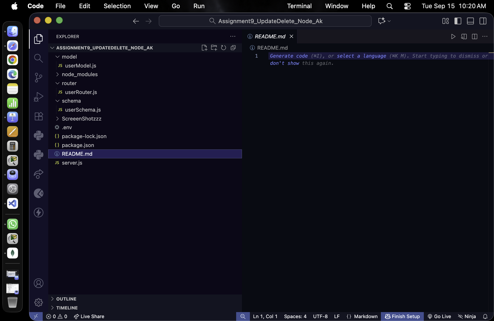
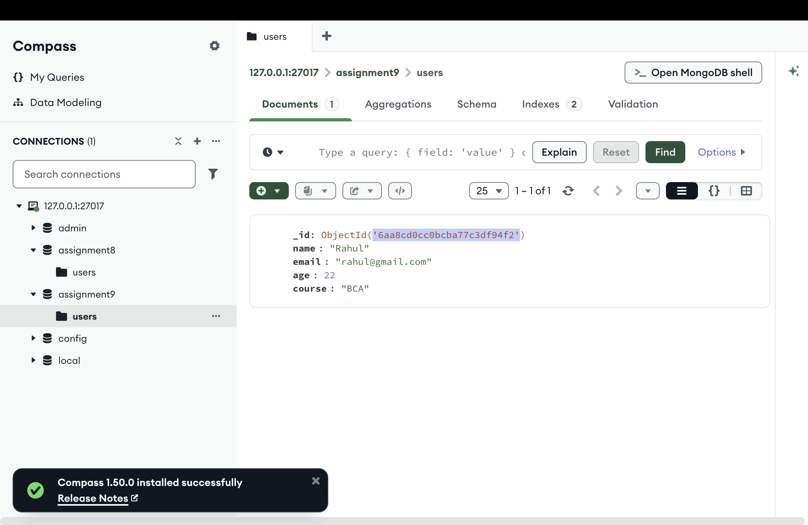
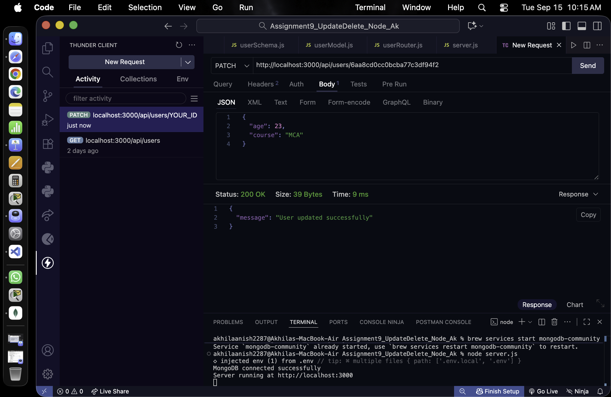
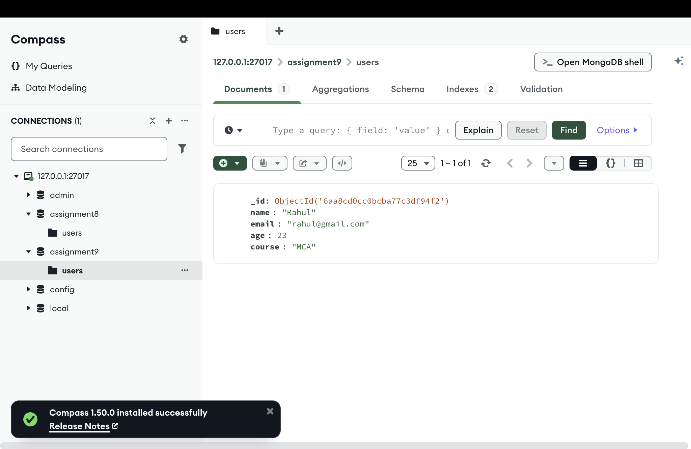
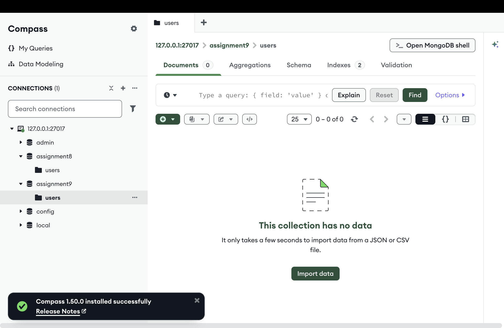
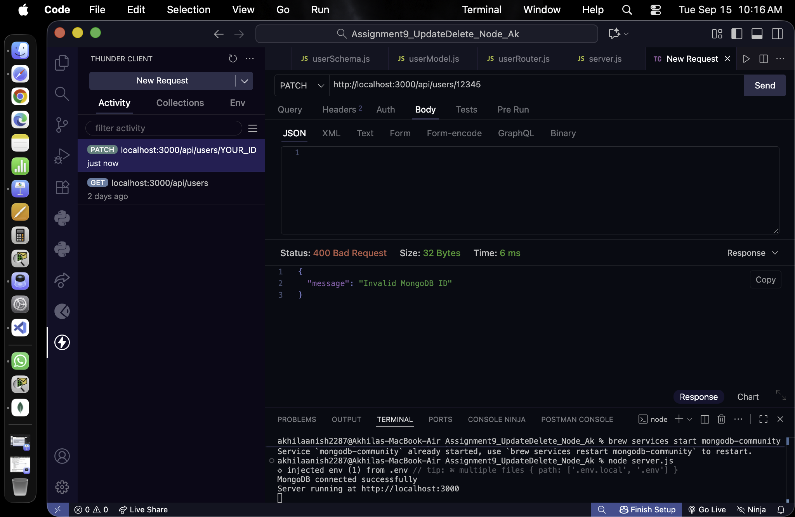
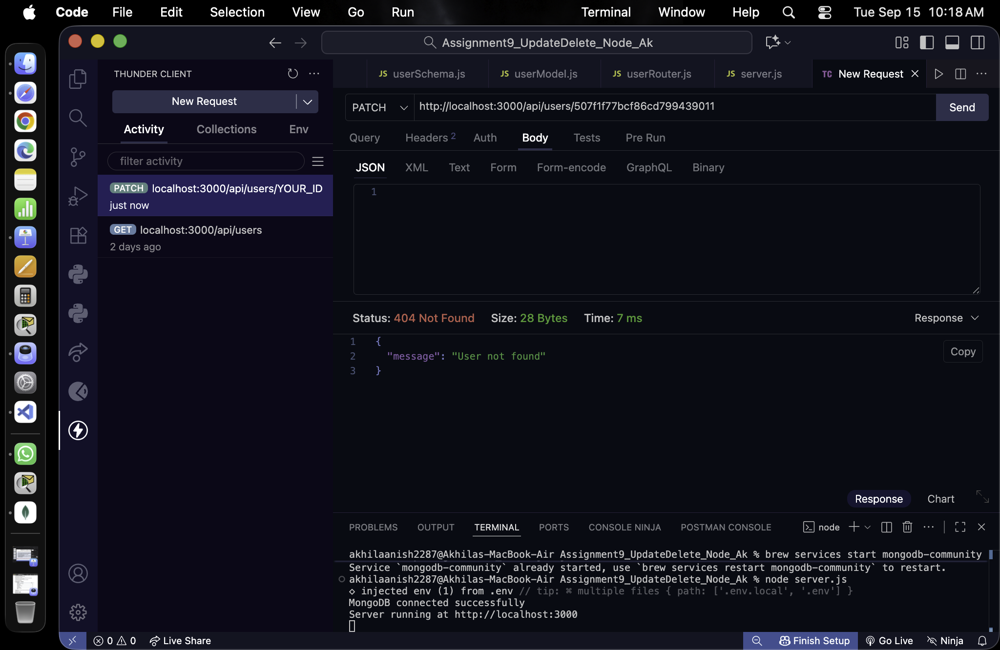

# User Update & Delete API

A REST API project developed using Node.js, Express.js, MongoDB, and Mongoose.  
This project demonstrates updating and deleting users from a MongoDB database using REST API endpoints.

---

## Student Information

**Student Name** | Akhila Anish Das <br>
**Roll No.** | 150096725016 <br>
**Cohort** | Larry Page 2025-2029 <br>
**Course** | B.Tech CSE 

---

## Project Overview

This project implements REST API operations for managing users stored in MongoDB.

The main operations implemented are:

- Update an existing user using the `PATCH` method
- Delete an existing user using the `DELETE` method
- Validate MongoDB ObjectIDs
- Check whether a user exists before performing an operation
- Handle invalid IDs
- Handle users that do not exist
- Handle database errors
- Connect Node.js with MongoDB using Mongoose
- Test the APIs using Thunder Client
- Verify database changes using MongoDB Compass

---

## Technologies Used

- Node.js
- Express.js
- MongoDB
- Mongoose
- dotenv
- Thunder Client
- MongoDB Compass
- Visual Studio Code

---

## Project Structure

The project is organized into separate folders for the model, schema, and router.

```text
Assignment9_UpdateDelete_Node_AK
│
├── model
│   └── userModel.js
│
├── router
│   └── userRouter.js
│
├── schema
│   └── userSchema.js
│
├── node_modules
│
├── .env
├── package.json
├── package-lock.json
├── README.md
└── server.js
````

### Project Structure Screenshot



---

# Database Configuration

The project uses a local MongoDB database.

**MongoDB URI:**

`mongodb://127.0.0.1:27017/assignment9`

**Database Name:**

`assignment9`

**Collection Name:**

`users`

The user documents contain the following fields:

| Field    | Type     | Required                |
| -------- | -------- | ----------------------- |
| `_id`    | ObjectId | Automatically generated |
| `name`   | String   | Yes                     |
| `email`  | String   | Yes                     |
| `age`    | Number   | No                      |
| `course` | String   | No                      |

The email field is configured as unique.

---

# API Endpoints

## 1. Update User

**Method:** `PATCH`

**Endpoint:**

`http://localhost:3000/api/users/:id`

The PATCH endpoint is used to update an existing user's information.

The MongoDB ObjectID is passed through the URL.

Before updating the user, the application:

1. Gets the ID from the request parameters.
2. Validates whether the ID is a valid MongoDB ObjectID.
3. Searches for the user.
4. Returns an error if the user does not exist.
5. Updates the provided user fields.
6. Returns a successful response after the update.

---

# Running the Project

## Step 1 — Install Node.js

Make sure Node.js is installed on the computer.

Verify the installation using the terminal.

```text
node --version
```

---

## Step 2 — Install MongoDB

Install MongoDB Community Server and make sure the MongoDB service is running.

The project connects to the local MongoDB server at:

```text
mongodb://127.0.0.1:27017
```

---

## Step 3 — Open the Project

Open the project folder in Visual Studio Code.

The project contains the model, router, schema, server, package files, and environment configuration.

---

## Step 4 — Install Dependencies

Open the terminal inside the project directory and run:

```text
npm install
```

This installs all dependencies specified in the project's `package.json`.

---

## Step 5 — Configure Environment Variables

Create a `.env` file in the root directory.

Add the MongoDB connection string:

```text
MONGO_URI=mongodb://127.0.0.1:27017/assignment9
```

This allows the application to connect to the local MongoDB database.

---

## Step 6 — Start the MongoDB Service

Make sure MongoDB is running before starting the Node.js application.

On macOS with Homebrew, MongoDB can be started using the installed MongoDB service.

---

## Step 7 — Start the Node.js Server

Run the following command from the project directory:

```text
node server.js
```

When everything is configured correctly, the terminal displays:

```text
MongoDB connected successfully
Server running at http://localhost:3000
```

---

# Testing the API

Thunder Client was used to test the REST API.

MongoDB Compass was used to verify the actual changes in the MongoDB database.

---

# PATCH — Update User

## Step 8 — Check the Existing User

Before updating a user, the existing user document can be viewed in MongoDB Compass.

The `users` collection contains the user's MongoDB ObjectID along with the user's information.

### MongoDB Document Before Update



The existing user contains the following information:

* Name: Rahul
* Email: [rahul@gmail.com](mailto:rahul@gmail.com)
* Age: 22
* Course: BCA

The MongoDB ObjectID is used when making the PATCH request.

---

## Step 9 — Send the PATCH Request

Open Thunder Client in Visual Studio Code.

Select the HTTP method:

`PATCH`

Use the endpoint:

`http://localhost:3000/api/users/:id`

Replace `:id` with the actual MongoDB ObjectID.

The request updates the user's information.

In the tested request, the following fields were updated:

* Age
* Course

### PATCH Request



The request was successfully sent to the API with the user's MongoDB ObjectID.

---

## Step 10 — Verify the PATCH Response

After sending the PATCH request, the server returns a successful response.

### Successful PATCH Response


The response shows:

`200 OK`

with the message:

`User updated successfully`

This confirms that the update operation was completed successfully.

---

## Step 11 — Verify the Updated Data in MongoDB

After the successful PATCH request, the user document was checked again in MongoDB Compass.

### Updated MongoDB Document



The updated document shows:

* Name: Rahul
* Email: [rahul@gmail.com](mailto:rahul@gmail.com)
* Age: 23
* Course: MCA

This confirms that the PATCH request successfully changed the data stored in MongoDB.

---

# DELETE — Delete User

## Step 12 — Send the DELETE Request

The DELETE endpoint is used to remove an existing user from the database.

**Method:**

`DELETE`

**Endpoint:**

`http://localhost:3000/api/users/:id`

The MongoDB ObjectID of the user is provided in the URL.

---

## Step 13 — Successful DELETE Response

After sending the DELETE request, the API verifies the ID and checks whether the user exists.

If the user exists, it is deleted from MongoDB.

### Successful DELETE Response


The response shows:

`200 OK`

with the message:

`User deleted successfully`

This confirms that the user was successfully deleted.

---

## Step 14 — Verify the Deletion in MongoDB Compass

After the DELETE request, the MongoDB collection was refreshed.

The user document is no longer present in the collection.

### MongoDB Collection After Delete



The screenshot confirms that the collection contains no remaining document after the deletion.

---

# Error Handling

The API includes validation and error handling for invalid IDs and users that do not exist.

---

# Invalid MongoDB ID

## Step 15 — Test an Invalid ID

The application validates the MongoDB ObjectID before attempting to find a user.

For example, an invalid ID such as:

`12345`

is not a valid MongoDB ObjectID.

The API returns:

**HTTP Status:** `400 Bad Request`

**Message:**

`Invalid MongoDB ID`

### Invalid MongoDB ID Response



This confirms that invalid MongoDB IDs are handled correctly.

---

# User Not Found

## Step 16 — Test a Non-Existing User

If the provided ID has a valid MongoDB ObjectID format but no matching user exists in the database, the API returns:

**HTTP Status:** `404 Not Found`

**Message:**

`User not found`

### User Not Found Response



This confirms that the API correctly handles requests for users that do not exist.

---

# API Response Status Codes

| Status Code                   | Description           | Situation                 |
| ----------------------------- | --------------------- | ------------------------- |
| **200 OK**                    | Request successful    | User updated or deleted   |
| **400 Bad Request**           | Invalid request       | Invalid MongoDB ObjectID  |
| **404 Not Found**             | Resource not found    | User does not exist       |
| **500 Internal Server Error** | Server/database error | Unexpected database error |

---

# How to Run the Project on Another Device

Anyone can run this project on another computer by following these steps.

## 1. Install the Required Software

Install:

* Node.js
* MongoDB Community Server
* Visual Studio Code

Optional but recommended:

* MongoDB Compass
* Thunder Client

---

## 2. Clone or Download the Repository

Clone the GitHub repository or download the project as a ZIP file.

Open the project folder in Visual Studio Code.

---

## 3. Install Dependencies

Open the terminal inside the project folder and run:

```text
npm install
```

---

## 4. Start MongoDB

Make sure the MongoDB service is running locally.

The application expects MongoDB to be available at:

```text
127.0.0.1:27017
```

---

## 5. Create the Environment File

Create a file named:

`.env`

in the root project directory.

Add:

```text
MONGO_URI=mongodb://127.0.0.1:27017/assignment9
```

---

## 6. Start the Application

Run:

```text
node server.js
```

The application will connect to MongoDB and start the Express server.

The server runs at:

`http://localhost:3000`

---

## 7. Test the PATCH API

Use Thunder Client or Postman.

Send a PATCH request to:

`http://localhost:3000/api/users/:id`

Replace `:id` with an existing MongoDB ObjectID.

---

## 8. Test the DELETE API

Send a DELETE request to:

`http://localhost:3000/api/users/:id`

Replace `:id` with the MongoDB ObjectID of the user you want to delete.

---

# Important Notes

* MongoDB must be running before starting the Node.js server.
* The MongoDB URI is stored in the `.env` file.
* A valid MongoDB ObjectID must be used in the API URL.
* The `users` collection must contain a user before testing the PATCH or DELETE operation.
* The database changes can be verified using MongoDB Compass.
* Thunder Client or Postman can be used to test the API.

---

# Testing Summary

The project was tested successfully for the following scenarios:

### Successful Update

The PATCH API successfully updated the user's age and course.

### Successful Delete

The DELETE API successfully removed the user from MongoDB.

### Invalid ID

An invalid MongoDB ID correctly returned:

`400 Bad Request`

### User Not Found

A valid but non-existing MongoDB ID correctly returned:

`404 Not Found`

### Database Verification

All successful changes were verified using MongoDB Compass.

---

# Conclusion

This project demonstrates the implementation of REST API operations for updating and deleting users using Node.js, Express.js, MongoDB, and Mongoose.

The project includes MongoDB ObjectID validation, user existence checks, appropriate HTTP status codes, database error handling, and API testing using Thunder Client.

The update and delete operations were successfully tested and verified using MongoDB Compass.

---

# Author

**Akhila Anish Das**

**Roll No.: 150096725016**

**Cohort:** Larry Page 2025-2029

**Course:** B.Tech CSE

```
